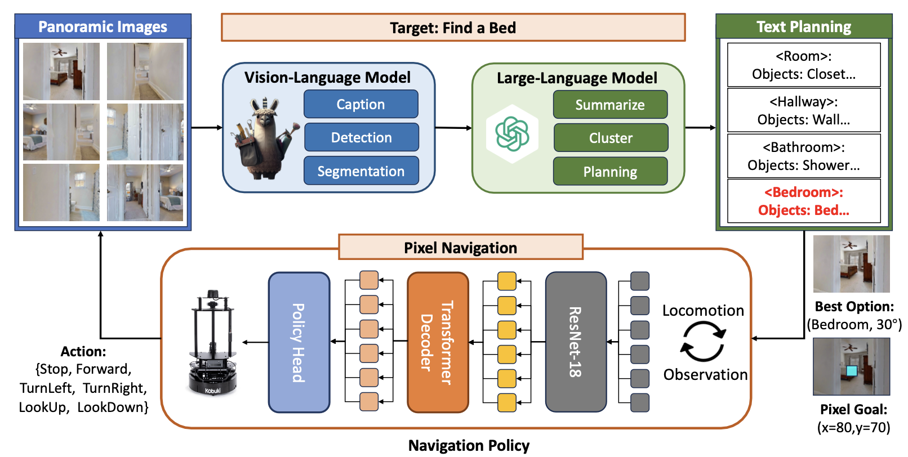

# PixelNav: Bridging Zero-Shot Object Navigation and Foundation Models through Pixel-Guided Navigation Skill, ICRA 2024 


This is the official implementation of the paper. Please refer to the [paper](https://arxiv.org/abs/2309.10309) and [website](https://sites.google.com/view/pixnav/) for more technique details.
### Dependency ###
Our project is based on the [habitat-sim](https://github.com/facebookresearch/habitat-sim?tab=readme-ov-file) and [habitat-lab](https://github.com/facebookresearch/habitat-lab). Please follow the guides to install them in your python environment. You can directly install the latest version of habitat-lab and habitat-sim. And make sure you have properly download the navigation scenes [(HM3D, MP3D)](https://github.com/facebookresearch/habitat-lab/blob/main/DATASETS.md) and the episode dataset for object navigation. Besides, make sure you have installed the following dependencies on your python environment:
```
numpy, opencv-python, tqdm, openai, torch
```
### Installation ###
Firstly, clone our repo as:
```
git clone https://github.com/wzcai99/Pixel-Navigator.git
cd Pixel-Navigator-master
```
Our method depends on an open-vocalbulary detection module [GroundingDINO](https://github.com/IDEA-Research/GroundingDINO) and a segmentation module [Segment-Anything](https://github.com/facebookresearch/segment-anything). You can either follow their website and follow the installation guide or just enter our /thirdparty directory and install locally as:
```
cd third_party/GroundingDINO
pip install -e .
cd ../Segment-Anything/
pip install -e .
```

### Prepare your GPT4V API Keys ###
To emphasize our contribution on the pixel navigation skill, in this repo, we replace the original complicated high-level planning process with GPT-4V. And you should prepare for your own api-keys and api-endpoint. You can check the ./llm_utils/gpt_request.py for more details.
```
export OPENAI_API_KEY=<YOUR KEYS>
export OPENAI_API_ENDPOINT=<YOUR_ENDPOINT>
```

### Download the checkpoints ###
| Module | Approach | Weight | Config |
| :------: | :--------: | :------: | :------: |
| Object Detection | GroundingDINO | [groundingdion_swinb_cogcoor.pth](https://drive.google.com/file/d/1kSH6AhUBrr-CxMrm4J3A9Pv__3WlCjDH/view?usp=drive_link) | GroundingDINO_SwinB_cfg.py |
| Object Segmentation | SAM | [sam_vit_h_4b8939.pth](https://drive.google.com/file/d/1cc6fk71zAK_8HJQltAKyM65nlcoN1eh1/view?usp=drive_link) | vit-h |
| Navigation Skill | PixelNav | [Checkpoint_A](https://drive.google.com/file/d/14iPb5buFOqEMuc_Luc_ShbVoo8xEIklu/view?usp=drive_link),[Chekcpoint_B](https://drive.google.com/file/d/1BSCpZ98iQytDHuIdiUYXJr_4DkX56AdW/view?usp=drive_link),[Checkpoint_C](https://drive.google.com/file/d/1CLQ4CUkLUylsvq7sNv1UbBQiGHRaK_45/view?usp=drive_link)| ---- |


We provide several different checkpoint for pixel navigation skill, which is trained on different dataset (scale,scenes..). You can make a choice for your own projects.  

### Evaluate the PixelNav Skill ###
Open the constants.py file and make sure you have prepared for all the input directory and checkpoint path. Then run the following command:
```
# prefix to decide hm3d or mp3d, difficulty to decide the pixelnav goal distance
# sensor_height to decide the camera height and image_hfov to decide the camera hfov
python evaluate_policy.py --prefix=hm3d --difficulty=easy --sensor_height=0.88 --image_hfov=79
```
The python code will automatically record the navigation process into the ./PREFIX_eval_trajectory/. The left side of the mp4 file records the image at the first frame and a pixel goal indicated as the blue dots. The right side of the mp4 file records the video stream of the navigation process and the estimated pixel goal and temporal distance. Examples show as follows: 


https://github.com/wzcai99/Pixel-Navigator/assets/115710611/bb16d54e-b280-4b4d-a07f-5afe0fe9c297

https://github.com/wzcai99/Pixel-Navigator/assets/115710611/d4e9b168-9e74-4b5c-badd-5caf1ac211f8


### Evaluate the ObjNav Benchmark ###
Open the constants.py file and make sure you have prepared for all the input directory and checkpoint path. Then run the following command:
```
python objnav_benchmark.py --checkpoint=<PIXELNAV_CHECKPOINT_PATH>
```
If everything goes well, you will see a new /tmp directory saving recording the navigation process. Examples show as below:


https://github.com/wzcai99/Pixel-Navigator/assets/115710611/64b5b079-2b48-4f35-a9a6-92a3e02298f9


https://github.com/wzcai99/Pixel-Navigator/assets/115710611/6a3d3a4d-d108-4d69-91e0-10e7a14c26c0

## BibTex
Please cite our paper if you find it helpful :)
```
@inproceedings{cai2024bridging,
  title={Bridging zero-shot object navigation and foundation models through pixel-guided navigation skill},
  author={Cai, Wenzhe and Huang, Siyuan and Cheng, Guangran and Long, Yuxing and Gao, Peng and Sun, Changyin and Dong, Hao},
  booktitle={2024 IEEE International Conference on Robotics and Automation (ICRA)},
  pages={5228--5234},
  year={2024},
  organization={IEEE}
}
```


